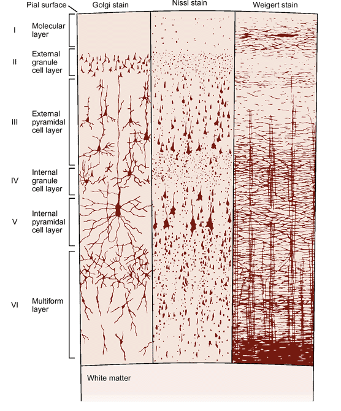

# Brain

### Overview

**Layer I**
  > This layer is called the molecular layer. As you can see from the diagram, it has very few neurons and cells. Instead, it is mainly composed of dendrites and axons that extend from lower levels of the neocortex.

**Layer II**
  > Because this is one of the outer layers, and it is composed of granule cells, scientists named it the external granule layer.

 > **Function**: Receives inputs from other areas of the neocortex.

**Layer III**
  > This is the external pyramidal cell layer. Pyramidal cells make up this layer; they are called "pyramidal" because their somas are triangular shaped.

  > **Function**: Receives input from other cortical regions and outputs to other cortical columns.

**Layer IV**
  > Located deeper within the neocortex, and composed of granule cells, this layer is thus called the internal granule layer.

  > **Function**: Granule cells in this layer receive sensory input and relay it to adjacent neocortex columns. Layer IV is very thick in primary sensory cortex (i.e. the primary visual cortex).

**Layer V**
  > Another layer of pyramidal cells makes up the neocortex. The cells in this internal pyramidal cell layer are larger than those in Layer III.

  > **Function**: Layer V is involved heavily in making motor movements.

**Layer VI**
  > Many different types of cells make up this layer. Its structure isn't very homogenous, so it was called the multiform layer.

  > **Function**: Receiving and integrating information from the brainstem and outputs to the thalamus.

### Terms
- **granule cells**: a number of different types of neuron whose only common feature is that they all have very small cell bodies
- **supragranular layers**: (Layers 1-3) - project out to other cortical columns, both sending and receiving signals, with layer III cells projecting to adjacent columns and layer II cells projecting to more distant parts of the cortex.
- **infragranular layers**: (Layers 5-6) - receive input from the supragranular cells of adjacent columns, although they do not reciprocate; instead, they send their signals to extracortical structures, such as the thalamus, and motor and sensory centers.
- **supragranular/infragranular process**:
  > Layer IV, which divides the column into supragranular and infragranular parts, receives its inputs from the thalamus and transmits signals to the rest of the column. The thalamus receives information from all parts of the cortex and subcortical areas. It works together with the cerebral cortex to create a feedback circuit by passing information from the infragranular cells of the cortex to the thalamus and then back to the layer IV cells of the cortex, with integration occuring both on in the thalamic and cortical centers.  

  > Information flow in the cortex is mediated by the action of the supragranular cells, while additional information from the external and internal environment is integrated by the thalamus and arrives in layer IV of the cortical columns.

### Visual

##### Links
  - [cortex overview](https://en.m.wikipedia.org/wiki/Cerebral_cortex)
  - [thalamus explained](http://www.scholarpedia.org/article/Models_of_thalamocortical_system#Core_vs._Matrix)
  - [granule cells](https://en.wikipedia.org/wiki/Granule_cell)
  - [supra/infra granular process](http://www.ruf.rice.edu/~lngbrain/Farh/col.html)
